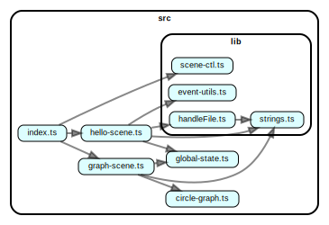

# Chromium JSON Bookmark Visualizer

Easily find bookmarks with its added time span, or recall what you've bookmarked at a time before.

[Go to app](https://dragonman225.github.io/bmvis)

## Project Structure

## Things that can be improved

* Find another hand-written font that supports more Chinese characters.

* Better algorithm for choosing circle background color.
  
  Currently, I use `d3.scaleOrdinal()` to map folder paths (as the domain) to colors (as the range). Idealy, different folders get different colors.

  But there are two problems :

  1. Number of folder paths are larger than number of pre-defined colors, so some folders get the same color even if their paths are very different.

  2. Folder can be nested. For example, `Web/CSS` and `Web/JS`. Currently two folders like that may get very different colors. But it would be nicer if folders with the same parent folder get similar colors, that is, maybe the same hue but different lightness in HSL color space.

* Visualized errors in the view. Currently, when errors are caught, they are printed to the console, but nothing shows in the view to notify users.

* Show time labels on the slider, so users can quickly navigate to a specific time.